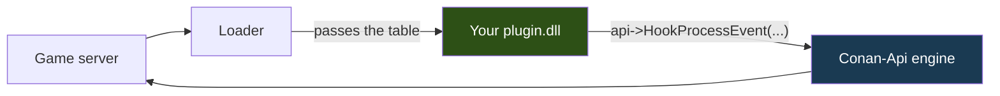

<p align="center">
  
</p>

<p align="center">
  <a href="../README.md">&nbsp;Portugu&ecirc;s</a>
  &nbsp;&nbsp;&middot;&nbsp;&nbsp;
  <a href="README.en.md">&nbsp;<b>English</b></a>
  &nbsp;&nbsp;&middot;&nbsp;&nbsp;
  <a href="README.es.md">&nbsp;Espa&ntilde;ol</a>
</p>

# Conan-Api SDK — write plugins for Conan Exiles

You need **one header** and a C++ compiler. There is no library to link, no code
of ours to compile alongside, no project to configure.

A whole plugin fits on one screen:

```cpp
#include "Conan/ConanPluginApi.h"

static const ConanApiTabela* g_api = nullptr;

// Called every time someone speaks in chat.
extern "C" ConanAcao AoFalar(ConanChamada* c)
{
    char texto[512];
    g_api->LerTextoDoJogo(c->Parms, 0x068, texto, sizeof(texto));

    if (texto[0] != '!') return CONAN_CONTINUAR;   // normal talk, let it through

    g_api->Log("someone typed: %s", texto);
    return CONAN_CANCELAR;                          // swallow it: a command, not talk
}

// Called once, when the server is ready.
extern "C" __declspec(dllexport)
void ConanPluginCarregar(const ConanApiTabela* api)
{
    if (!api || api->tamanho < sizeof(ConanApiTabela)) return;
    g_api = api;
    g_api->HookProcessEvent("ServerSendChatMessage", AoFalar, nullptr, 100);
}
```

Build it as an x64 DLL, put it in a folder named after your plugin inside
`Conan-Api/Plugins/`, start the server. Done.

---

## How this works, briefly

The Conan server has no plugin system. The one that creates it is the
**Conan-Api**, which enters the game process alongside it and maps everything in
there by reflection — the classes, the members, the functions.

Your plugin does not talk to the game. It talks to the API:



When the loader switches your plugin on, it hands over a **table of function
pointers**. Everything you do comes from there: `api->Log(...)`,
`api->FindObjects(...)`, `api->HookProcessEvent(...)`. None of our code goes into
your binary.

That has three practical consequences, and all of them are good for you:

**Your compiler does not matter.** Most plugin APIs force you to use exactly the
compiler they used. The reason is real: a C++ library does not cross compilers —
the layout of `std::string` and of vtables changes between MSVC and MinGW, and
changes even between MSVC versions. When it does not match, there is no clear
error: it links, it runs, and it corrupts memory on the first string that crosses
the boundary. Here the boundary is a plain C `struct` with `__cdecl`, and every
compiler agrees on that.

**We fix defects without you rebuilding.** The engine lives on our side. When we
fix something in it, your published plugin gets the fix on its own.

**The table only grows.** A new field always goes at the **end**, and nothing is
removed or reordered. This is exercised on a real server: a plugin built against
v3 (a 328-byte table) was loaded on top of a v6 API (376 bytes), called a
function, and the server stayed up.

---

## Building

### Visual Studio

1. **New Project** → *Dynamic-Link Library (DLL)*
2. **C/C++ → General → Additional Include Directories**: point at `include`
3. **C/C++ → Code Generation → Runtime Library**: `/MT`, not `/MD`
4. **Platform: x64**

Or straight from the command line:

```bat
cl /nologo /std:c++17 /O2 /EHsc /LD /MT ^
   /I "path\to\sdk\include" ^
   MyPlugin.cpp /Fe:MyPlugin.dll
```

**`/MT` really matters.** With `/MD`, your DLL depends on the Microsoft runtime
being installed on the machine — and many servers run under Wine, in a container
where that runtime may not exist. The symptom is `LoadLibrary` failing with a
generic code that explains nothing. With `/MT` the runtime goes inside your DLL
and the problem does not exist.

To check it worked:

```bat
dumpbin /dependents MyPlugin.dll
```

Only `KERNEL32.dll` should show up. If `MSVCP140.dll` or `VCRUNTIME140.dll`
appear, `/MT` did not take.

### mingw-w64

```bash
x86_64-w64-mingw32-g++ -std=c++17 -O2 -shared \
    -I path/to/include \
    -o MyPlugin.dll MyPlugin.cpp \
    -static-libgcc -static-libstdc++
```

The `-static-*` for the same reason as `/MT`.

### What we test on every version

| you use | works? | tested by us |
|---|---|---|
| Visual Studio 2026 (`cl` 19.51) | yes | **yes** — every release |
| Visual Studio 2017–2022 (v141–v143) | yes | not directly; the C ABI has not changed |
| mingw-w64 (GCC 13+) | yes | **yes** — every build |
| clang targeting Windows | yes | not directly |

This is not a statement of intent. On every version we download the published
package, build `ExemploOla` with MinGW **and** with MSVC, and bring both
binaries up on the same server. If either one stops working, the release does not
ship.

---

## Start by copying an example

```bash
cp -r Exemplos/ExemploOla MyPlugin
cd MyPlugin
mv ExemploOla.cpp MyPlugin.cpp
sed -i 's/ExemploOla/MyPlugin/g' compilar.sh
./compilar.sh
```

| example | what it teaches |
|---|---|
| **ExemploOla** | the smallest plugin that still proves something: find an object, call a function, write to the log |
| **ExemploComando** | intercept `!command` in chat and swallow the message |
| **ExemploVigia** | welcome on login, count who is online, answer chat commands |
| **ExemploVip** | query Permission and keep working when it is not installed |
| **ExemploAgendado** | run code periodically, on the right thread |
| **ExemploBlueprint** | intercept Blueprint execution — what a hook by name cannot see. **Read the warning at the top of the file**: an earlier version of it left a window where every Blueprint execution was silently dropped, and since Conan's login is made of Blueprint, nobody could join the server |
| **Permission** | the complete plugin: database, configuration, and an ABI others consume |

---

## The whole game, with real signatures

Beyond the table, the package ships **`ConanSDK.h`**: **9,247 Conan classes**
with the members and functions the game's own reflection declares. It is not a
list of names — **89% of the 38,340 functions carry a complete signature**, with
the type and name of every parameter, checked against the running server.

In practice you write like this:

```cpp
#include "Conan/ConanSDK.h"

void ConanPluginCarregar(const ConanApiTabela* api)
{
    ConanApi::UsarTabela(api);          // <- required, once

    cm->TeleportPlayer(1000.0f, 2000.0f, 300.0f);   // a saved point
    FVector where = actor->K2_GetActorLocation();    // where it is
    cm->CheatSpawnItem(TemplateId, amount);          // an item for your shop
}
```

**`ConanApi::UsarTabela(api)` is not optional.** The header has no way to reach
the table on its own — it arrives in your `ConanPluginCarregar`. Without that
line every SDK call quietly becomes nothing, which is why the first one warns on
`stderr` instead of leaving you to hunt for the reason.

An **output** parameter becomes a reference, and the API copies the value back:

```cpp
FHitResult hit{};
actor->K2_SetActorLocation(target, false, hit, true);
```

Output text becomes `char*` plus capacity, already **decoded** — never the
game's pointer, which dies when the call returns:

```cpp
char left[64], right[64];
lib->Split("conan|api", "|", left, sizeof(left), right, sizeof(right));
```

**And you link nothing.** The whole SDK talks through the table — that is why it
behaves the same under MSVC, MinGW and clang. If your project ever asks for a
`libconanapi.a`, something is wrong: there is no library of ours to link.

The remaining 11% come out as a generic template, and that is deliberate: they
are types that **carry ownership of game memory** (`TArray<FString>`, `TMap`,
multicast delegates). Passing them by value would duplicate pointers, and someone
would free twice. We prefer an untyped template over a signature that corrupts.

---

## The structure of a plugin

```
Conan-Api/Plugins/MyPlugin/
   MyPlugin.dll         <- the loader looks for this name first
   PluginInfo.json      <- name, version, what you require (optional, but do it)
   config.json          <- your configuration
   mydatabase.db        <- whatever you write is born here
```

### What is required, and what is not

**Only the DLL.** A plugin with nothing but that loads and works — this project's
`Cartografo` and `GravadorDeEventos` run exactly like that, and the log shows:

```
  [ok] Cartografo   [sem PluginInfo.json]
```

The other two files are your choices:

| file | required? | who reads it |
|---|---|---|
| `MyPlugin.dll` | **yes** — the only thing the loader needs | the loader |
| `PluginInfo.json` | no | the loader, **if** it exists |
| `config.json` | no | **your plugin**; the API never opens it |

`config.json` has no format imposed by anyone. The API only tells you **where**
it lives, through `CaminhoConfig("MyPlugin")`, and the rest is yours — it can be
JSON, it can have another name, it can not exist at all.

**Without `PluginInfo.json` you lose four things**, worth knowing before you
decide to skip it:

- your plugin's name and version in the log (only the folder name shows up)
- `MinApiVersion` — the loader cannot refuse your plugin on an old API
- `Dependencies` — nothing guarantees Permission comes up before you
- `BuildDoJogo` / `UsaOffsetsCrus` — without them your plugin loads after a game
  update even when it should not

For a plugin you only use yourself, none of that matters. For one you
**publish**, all of it does.

`PluginInfo.json` is your plugin's identity card:

```json
{
  "FullName":      "My Plugin",
  "Description":   "What it does, in one line",
  "Version":       "1.0.0",
  "MinApiVersion": 3,
  "Dependencies":  ["Permission"]
}
```

**`MinApiVersion`** makes the loader **refuse** your plugin on an API that is too
old, instead of letting it run and read garbage. The table in this version is
**v6** — but declare the lowest number you actually need, not the highest. Asking
for v6 without using anything from v6 refuses to run on a server still on v5, for
no reason at all.

**`Dependencies`** makes sure Permission comes up before you. Without it you
would ask it before it exists and conclude it is not installed. (That happened
here, with one of our own plugins.)

**Store everything through the API**, never by relative path:

```cpp
const char* db = g_api->CaminhoDados("MyPlugin", "mydatabase.db");
```

A relative path resolves from the **server's** directory, not your folder. One of
our plugins wrote 9 MB per boot in the wrong place that way.

---

## If your plugin uses raw offsets, declare it

This is the difference between a plugin that survives a Conan update and one that
starts reading the wrong memory in silence:

```json
{ "BuildDoJogo": 24784646, "UsaOffsetsCrus": true }
```

When you declare it and the game build changes, **the loader refuses your
plugin** and tells the server owner to ask you for a new version. Without the
declaration it loads and reads the neighbouring field — no error, no log, no
clue.

**How to not need this:** use `api->OffsetDoMembro(obj, "FieldName")` instead of
the number. It resolves through reflection, on whatever build is running, and
your plugin crosses the update without you doing anything.

---

## Answering in the first second

The server accepts players **before** the world finishes building. In that window
reflection does not exist yet, so a plugin switched on only after it leaves
whoever typed an early command with no answer.

There is a second, optional entry point for that:

```cpp
extern "C" __declspec(dllexport)
void ConanPluginRegistrar(const ConanApiTabela* api)   // BEFORE the world
{
    ConanApi::UsarTabela(api);
    g_id = api->HookProcessEvent("ServerSendChatMessage", AoFalar, nullptr, 100);
}
```

`HookProcessEvent` called here **goes into a queue** and returns a valid id right
away. The API arms the hook the moment the world builds — before any plugin is
switched on.

**What you cannot do here:** touch a game object. There is no world, and
`FindClass`/`FindObjects` return nothing. If you need the world, the place is
`ConanPluginCarregar`.

You do not have to export `Registrar`. Without it everything works as before — it
only shortens the window.

---

## Using Permission

Nothing to link — it is `GetProcAddress` underneath, in a small header:

```cpp
#include "Conan/ConanPermission.h"

char id[64];
if (ConanPermIdDoController(controller, id, sizeof(id)) > 0)
    if (ConanPermTem(id, "myplugin.daily.kit", /*if_absent=*/0) == 1)
        GiveKit(controller);
```

If Permission is not installed, the functions return the `if_absent` value you
passed and your plugin keeps running.

**Ask at the moment of use, not at load.** And pick `if_absent` by the cost of
being wrong: for a VIP kit, `0` (denying for thirty seconds is annoying; handing
it to everyone during a database outage cannot be undone).

---

## What the API will not let you do, and why

**Hook any address.** `HookFuncao` refuses about 32% of them, with the reason in
`TextoRecusa`. That is not a failure: it is the API refusing to install a detour
that would one day execute half an instruction, corrupting memory hours later,
somewhere unrelated to the cause.

**Pass the wrong size.** `ChamarFuncao` checks the size of each argument against
the real parameter and refuses when they do not match. If you pass a `float`
where the game expects a `double`, it stops and says so. We measured: **293
functions** in this build corrupt the stack down that path, and the symptom shows
up far from the cause.

**Build a game string yourself.** The game destroys the parameter block on return
and calls **its own** allocator on whatever pointer is there. If that is your
memory, the server goes down — tested, not theory.

You do not need to do that: **write ordinary text and the API builds it**.

```cpp
g_api->MensagemParaTodos("The server restarts in 5 minutes.");
g_api->MensagemParaJogador("PlayerName", "Kit delivered. Come back in 24h.");
g_api->MensagemNaTela(playerController, "Welcome!", 8.0f);
```

Underneath, the API asks the **game itself** for the `FString` (or the `FText`)
and hands back what it built. None of your memory crosses the boundary, and
whoever allocates is whoever frees.

---

## When it does not work: where to look

Two files answer almost everything, in `Conan-Api/Logs/`:

| file | what it tells you |
|---|---|
| `ConanLoader.log` | which plugins the loader **saw**, which it **refused** and why |
| `ConanApi.log` | what plugins wrote with `Log()`, and the engine's warnings |

**The DLL will not open.** Almost always architecture (built x86 instead of x64)
or `/MD` instead of `/MT`. Windows error `193` means, in practice, 32-bit.

**It opened, but nothing happens.** Check that the folder name and the DLL name
match, and that you exported `ConanPluginCarregar`. On MSVC, without `extern "C"`
the name comes out decorated and the loader cannot find it:

```bat
dumpbin /exports MyPlugin.dll | findstr ConanPlugin
```

You should see `ConanPluginCarregar`, not `?ConanPluginCarregar@@YAXPEBU...`.

**`ConanSDK.h` calls do nothing.** `ConanApi::UsarTabela(api)` is missing.

**The function returns `false` and you cannot tell whether it ran.** Use
`api->UltimaChamadaExecutou()`. The game filters calls on template objects and
uninitialised actors, and in those cases the return comes from a zeroed block —
without that signal, "the function said no" and "the function did not run" become
the same `false`.

**You wrote to a field and the client does not see it.** The field is replicated;
there are 1,222 of the 36,210 in this build. Ask first with
`api->EhReplicado(...)` and prefer calling the game's own function, which walks
the path that already replicates.

---


## Published a plugin?

Open an *issue* here and tell us. The idea is to keep a list in the README so
server owners can find what exists.

Before publishing, a short checklist:

- [ ] builds x64, with `/MT` (MSVC) or `-static-*` (MinGW)
- [ ] the folder is named after the plugin, and so is the DLL
- [ ] everything it writes goes through `CaminhoDados("YourPlugin", ...)`
- [ ] it checks `api->tamanho` before using the table
- [ ] `DllMain` does nothing
- [ ] if it uses Permission, it asks at use time and degrades when it is missing
- [ ] it ran on a real server — a test does not prove the real path

---

## To run a server

That is another repository: **[Conan-Api](../../../Conan-Api)**. The loader, the
ready-made package and the install guide live there.

They are separate on purpose: someone running a server needs no compiler at all,
and someone writing a plugin needs none of the server binaries.

---

## Credits

*Conan Exiles* belongs to **Funcom**. The images in this repository are official
promotional material, from Steam. This project has no affiliation with Funcom or
Inflexion Games.

This API is independent work, done by reverse engineering the dedicated server,
with no official SDK and no debug symbols.

<p align="center">
  <a href="../README.md">&nbsp;Portugu&ecirc;s</a>
  &nbsp;&nbsp;&middot;&nbsp;&nbsp;
  <a href="README.en.md">&nbsp;<b>English</b></a>
  &nbsp;&nbsp;&middot;&nbsp;&nbsp;
  <a href="README.es.md">&nbsp;Espa&ntilde;ol</a>
</p>
