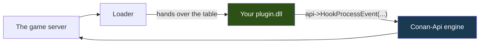
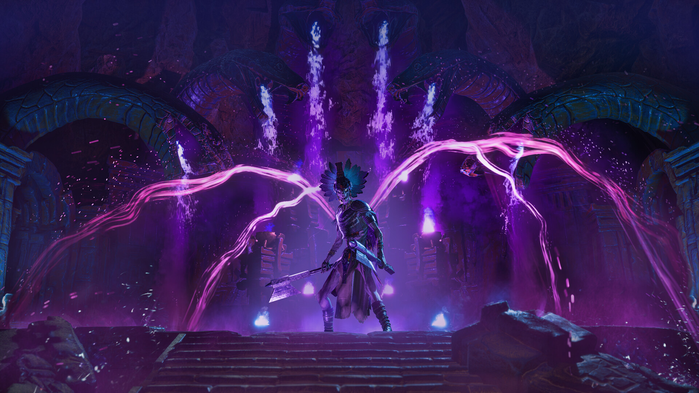

<p align="center">
  
</p>

<p align="center">
  <a href="../README.md">&nbsp;Portugu&ecirc;s</a>
  &nbsp;&nbsp;&middot;&nbsp;&nbsp;
  <a href="README.en.md">&nbsp;<b>English</b></a>
  &nbsp;&nbsp;&middot;&nbsp;&nbsp;
  <a href="README.es.md">&nbsp;Espa&ntilde;ol</a>
</p>

# Conan-Api SDK — write plugins for Conan Exiles

You need **one header** and a C++ compiler. There is no library to link, no code
of ours to compile alongside yours, no project to configure.

```cpp
#include "Conan/ConanPluginApi.h"

static const ConanApiTabela* g_api = nullptr;

extern "C" ConanAcao OnChat(ConanChamada* c)
{
    char text[512];
    g_api->LerTextoDoJogo(c->Parms, 0x068, text, sizeof(text));

    if (text[0] != '!') return CONAN_CONTINUAR;   // ordinary chat, let it through

    g_api->Log("someone typed: %s", text);
    return CONAN_CANCELAR;                          // swallows the message
}

extern "C" __declspec(dllexport)
void ConanPluginCarregar(const ConanApiTabela* api)
{
    if (!api || api->tamanho < sizeof(ConanApiTabela)) return;
    g_api = api;
    g_api->HookProcessEvent("ServerSendChatMessage", OnChat, nullptr, 100);
}
```

Build it as an x64 DLL, put it in a folder named after your plugin inside
`Conan-Api/Plugins/`, restart the server. That is it.

---

## Why your compiler does not matter

Most plugin APIs force you to use exactly the compiler they used. The reason is
real: a C++ library does not survive a change of compiler. The layout of
`std::string` and of a vtable changes between MSVC and MinGW, and it changes even
between MSVC versions. When they do not match, there is no clear error — it
links, it runs, and it corrupts memory on the first string that crosses the
border.

That does not happen here, because **you link nothing of ours**. The loader calls
your plugin passing it a table of function pointers, and you call everything
through `api->`:



Everything in plain C: a `struct` of function pointers, `__cdecl` convention.
Visual Studio of any version, MinGW, clang — they all agree about this.

**A side effect worth knowing:** since the engine lives on our side, when we fix
a defect in it, your plugin does not have to be recompiled.

---

## Visual Studio

1. **New Project** → *Dynamic-Link Library (DLL)*
2. **C/C++ → General → Additional Include Directories**: point it at `include`
3. **C/C++ → Code Generation → Runtime Library**: `/MT`, not `/MD`
4. **Platform: x64**

The `/MT` matters. With `/MD`, your DLL depends on the Microsoft runtime being
installed on the machine — and the server runs under Wine, in a container where
that runtime may not exist. The symptom is `LoadLibrary` failing with a generic
code that explains nothing. With `/MT`, the runtime travels inside your DLL.

There is nothing to link: no `.lib`, no `.a`, no `.cpp` of ours to add.

## mingw-w64

```bash
x86_64-w64-mingw32-g++ -std=c++17 -O2 -shared \
    -I path/to/include \
    -o MyPlugin.dll MyPlugin.cpp \
    -static-libgcc -static-libstdc++
```

The `-static-*` for the same reason as the `/MT`.

---

## Start by copying an example

```bash
cp -r Exemplos/ExemploOla MyPlugin
cd MyPlugin
mv ExemploOla.cpp MyPlugin.cpp
sed -i 's/ExemploOla/MyPlugin/g' compilar.sh
./compilar.sh
```

| example | what it teaches |
|---|---|
| **ExemploOla** | the smallest plugin that still proves something: find an object, call a function, write to the log |
| **ExemploComando** | intercept `!command` in chat and swallow the message |
| **ExemploVigia** | greet players on login, count who is online and answer chat commands |
| **ExemploVip** | query Permission and keep working when it is not installed |
| **ExemploAgendado** | run code every so often, on the right thread |
| **ExemploBlueprint** | intercept Blueprint execution — what a hook by name does not see |
| **Permission** | the complete plugin: database, configuration, and an ABI others consume |

---

## The structure of a plugin

```
Conan-Api/Plugins/MyPlugin/
   MyPlugin.dll         <- the loader looks for this name first
   PluginInfo.json      <- name, version, what you require (optional, but do it)
   config.json          <- your configuration
   mydatabase.db        <- whatever you write is born here
```

The `PluginInfo.json` is the identity card:

```json
{
  "FullName":      "My Plugin",
  "Description":   "What it does, in one line",
  "Version":       "1.0.0",
  "MinApiVersion": 2,
  "Dependencies":  ["Permission"]
}
```

`MinApiVersion` makes the loader **refuse** your plugin on an API that is too
old, instead of letting it run and read garbage. `Dependencies` guarantees that
Permission comes up before you — without it, you would ask it something before it
existed, and conclude that it is not installed. (That really happened here.)

**Store everything through the API**, never through a relative path:

```cpp
const char* database = g_api->CaminhoDados("MyPlugin", "mydatabase.db");
```

A relative path is resolved from the **server's** directory, not from your
folder. A plugin of ours already wrote 9 MB per boot in the wrong place that way.

---

## Using Permission

Nothing to link — it is `GetProcAddress` underneath, in a small header:

```cpp
#include "Conan/ConanPermission.h"

char id[64];
if (ConanPermIdDoController(controller, id, sizeof(id)) > 0)
    if (ConanPermTem(id, "myplugin.kit.daily", /*se_ausente=*/0) == 1)
        GiveKit(controller);
```

If Permission is not installed, the functions return the `se_ausente` value you
passed — that parameter name is Portuguese for "if absent" — and your plugin
keeps running. **Ask at the moment of use, not at load time** — loading is too
early.

---

## What the API will not let you do, and why

**Refusing a hook.** `HookFuncao` refuses about 32% of the addresses, with the
reason in `TextoRecusa`. That is not a failure: it is the API refusing to install
a detour that one day would execute half an instruction, corrupting memory hours
later, somewhere unrelated to the cause.

**Passing the wrong size.** `ChamarFuncao` checks the size of each argument
against the real parameter and refuses when they do not match. If you pass a
`float` where the game expects a `double`, it stops and says so. We measured:
**293 functions** in this build corrupt the stack down that path, and the symptom
shows up far from the cause.

**Sending text of your own to the game.** You read text that already belongs to
the game as much as you like. But building a string of yours and passing it along
brings the server down: the game destroys the parameter block on return and calls
**its** allocator on **your** memory. This was tested, it is not theory.

---



## The whole game, with real signatures

`ConanSDK.h` brings **8,287 Conan classes** with the members and functions the
game's own reflection declares. It is not a list of names: **85% of the 36,757
functions carry a complete signature** — type and name of every parameter,
checked against the running server itself.

```cpp
#include "Conan/ConanSDK.h"

void ConanPluginCarregar(const ConanApiTabela* api)
{
    ConanApi::UsarTabela(api);          // <- required, once

    cm->TeleportPlayer(1000.0f, 2000.0f, 300.0f);   // a saved point
    FVector where = actor->K2_GetActorLocation();    // where it is
    cm->CheatSpawnItem(TemplateId, amount);          // an item for your shop
}
```

**`ConanApi::UsarTabela(api)` is not optional.** The header has no way to reach
the table on its own — it arrives in your `ConanPluginCarregar`. Without that
line every SDK call quietly becomes nothing, which is why the first one warns on
`stderr` instead of leaving you to hunt for the reason.

An **output** parameter becomes a reference, and the API copies the value back:

```cpp
FHitResult hit{};
actor->K2_SetActorLocation(target, false, hit, true);
```

Output text becomes `char*` plus capacity, **decoded** — never the game's
pointer, which dies when the call returns:

```cpp
char left[64], right[64];
lib->Split("conan|api", "|", left, sizeof(left), right, sizeof(right));
```

An output list becomes pointer, capacity and count, with the **elements**
copied:

```cpp
AActor* found[32]; int howMany = 0;
lib->SomeActorSearch(..., found, 32, howMany);
```

**You link nothing.** The entire SDK talks through the function table — that is
why it behaves the same under MSVC, MinGW and clang. If your project ever asks
for a `libconanapi.a`, something is wrong: there is no library of ours for you
to link.

The remaining 15% come out as a generic template, and that is deliberate: they
are types that **carry ownership of game memory** (`TArray<FString>`, `TMap`,
multicast delegates). Passing them by value would duplicate pointers, and
someone would free twice. We prefer an untyped template over a signature that
corrupts.

---


## Published a plugin?

Before publishing, check:

- [ ] it builds for **x64**, with `/MT` (MSVC) or `-static-*` (MinGW)
- [ ] the folder carries the plugin's name, and so does the DLL
- [ ] everything it writes goes through `CaminhoDados("YourPlugin", ...)`
- [ ] it checks `api->tamanho` before using the table
- [ ] `DllMain` does nothing (Windows holds a global lock in there)
- [ ] it has a `PluginInfo.json` with a version and `MinApiVersion`
- [ ] **you ran it on a real server** — building is not working

---

## To run a server

That is another repository: **[Conan-Api](../../../../Conan-Api)** — the loader,
the ready-made plugins and how to install them.

---

## Credits

*Conan Exiles* belongs to **Funcom**. The images are official promotional
material from Steam. This project is independent and has no affiliation with
Funcom or with Inflexion Games.

<p align="center">
  <a href="../README.md">&nbsp;Portugu&ecirc;s</a>
  &nbsp;&nbsp;&middot;&nbsp;&nbsp;
  <a href="README.en.md">&nbsp;<b>English</b></a>
  &nbsp;&nbsp;&middot;&nbsp;&nbsp;
  <a href="README.es.md">&nbsp;Espa&ntilde;ol</a>
</p>
