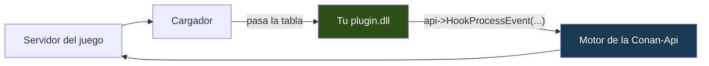

<p align="center">
  
</p>

<p align="center">
  <a href="../README.md">&nbsp;English</a>
  &nbsp;&nbsp;&middot;&nbsp;&nbsp;
  <a href="README.pt.md">&nbsp;Portugu&ecirc;s</a>
  &nbsp;&nbsp;&middot;&nbsp;&nbsp;
  <a href="README.es.md">&nbsp;<b>Espa&ntilde;ol</b></a>
</p>

# Conan-Api SDK — escribe plugins para Conan Exiles

Si ya escribiste plugins para **ArkApi** o **AsaApi**, esto es lo mismo para
Conan Exiles: el plugin corre dentro del servidor, el jugador no descarga nada, y
hablas con el juego por una tabla de funciones.

Necesitas **un header** y un compilador de C++. No hay biblioteca que enlazar,
no hay código nuestro que compilar al lado, no hay proyecto que configurar.

Un plugin entero cabe en una pantalla:

```cpp
#include "Conan/ConanPluginApi.h"

static const ConanApiTabela* g_api = nullptr;

// Llamado cada vez que alguien habla en el chat.
extern "C" ConanAcao AoFalar(ConanChamada* c)
{
    char texto[512];
    g_api->LerTextoDoJogo(c->Parms, 0x068, texto, sizeof(texto));

    if (texto[0] != '!') return CONAN_CONTINUAR;   // charla normal, que pase

    g_api->Log("alguien escribió: %s", texto);
    return CONAN_CANCELAR;                          // se la traga: es comando
}

// Llamado una vez, cuando el servidor está listo.
extern "C" __declspec(dllexport)
void ConanPluginCarregar(const ConanApiTabela* api)
{
    if (!api || api->tamanho < sizeof(ConanApiTabela)) return;
    g_api = api;
    g_api->HookProcessEvent("ServerSendChatMessage", AoFalar, nullptr, 100);
}
```

Compílalo como DLL x64, ponlo en una carpeta con el nombre de tu plugin dentro
de `Conan-Api/Plugins/`, arranca el servidor. Ya está.

---

## Cómo funciona esto, en pocas palabras

El servidor de Conan no tiene sistema de plugins. Quien lo crea es la
**Conan-Api**, que entra en el proceso del juego junto con él y mapea todo lo
que hay dentro por reflexión — las clases, los miembros, las funciones.

Tu plugin no habla con el juego. Habla con la API:



Cuando el cargador enciende tu plugin, le pasa una **tabla de punteros a
función**. Todo lo que haces sale de ahí: `api->Log(...)`,
`api->FindObjects(...)`, `api->HookProcessEvent(...)`. Nada de nuestro código
entra en tu binario.

Eso tiene tres consecuencias prácticas, y todas son buenas para ti:

**Tu compilador no importa.** La mayoría de las APIs de plugins te obliga a usar
exactamente el compilador que usaron ellas. El motivo es real: una biblioteca de
C++ no cruza compiladores — la disposición de `std::string` y de las vtables
cambia entre MSVC y MinGW, y cambia incluso entre versiones de MSVC. Cuando no
coincide no hay error claro: enlaza, corre, y corrompe memoria en la primera
cadena que cruce la frontera. Aquí la frontera es una `struct` en C puro con
convención `__cdecl`, y en eso todos los compiladores están de acuerdo.

**Arreglamos defectos sin que recompiles.** El motor vive de nuestro lado.
Cuando corregimos algo, tu plugin publicado recibe la corrección solo.

**La tabla solo crece.** Un campo nuevo entra siempre al **final**, y nada se
quita ni se reordena. Está ejercitado en un servidor real: un plugin compilado
contra la v3 (tabla de 328 bytes) se cargó sobre una API v6 (376 bytes), llamó a
una función y el servidor siguió en pie.

---

## Compilar

### Visual Studio

1. **Nuevo Proyecto** → *Biblioteca de Vínculos Dinámicos (DLL)*
2. **C/C++ → General → Directorios de Inclusión Adicionales**: apunta a `include`
3. **C/C++ → Generación de Código → Biblioteca en Tiempo de Ejecución**: `/MT`, no `/MD`
4. **Plataforma: x64**

O directamente desde la línea de comandos:

```bat
cl /nologo /std:c++17 /O2 /EHsc /LD /MT ^
   /I "ruta\del\sdk\include" ^
   MiPlugin.cpp /Fe:MiPlugin.dll
```

**El `/MT` importa de verdad.** Con `/MD`, tu DLL depende de que el runtime de
Microsoft esté instalado en la máquina — y muchos servidores corren bajo Wine,
en un contenedor donde ese runtime puede no existir. El síntoma es `LoadLibrary`
fallando con un código genérico que no explica nada. Con `/MT` el runtime va
dentro de tu DLL y el problema no existe.

Para comprobar que salió bien:

```bat
dumpbin /dependents MiPlugin.dll
```

Debe aparecer solo `KERNEL32.dll`. Si aparecen `MSVCP140.dll` o
`VCRUNTIME140.dll`, el `/MT` no se aplicó.

### mingw-w64

```bash
x86_64-w64-mingw32-g++ -std=c++17 -O2 -shared \
    -I ruta/al/include \
    -o MiPlugin.dll MiPlugin.cpp \
    -static-libgcc -static-libstdc++
```

Los `-static-*` por el mismo motivo que el `/MT`.

### Lo que probamos en cada versión

| usas | ¿funciona? | probado por nosotros |
|---|---|---|
| Visual Studio 2026 (`cl` 19.51) | sí | **sí** — en cada release |
| Visual Studio 2017–2022 (v141–v143) | sí | no directamente; la ABI de C no ha cambiado |
| mingw-w64 (GCC 13+) | sí | **sí** — en cada build |
| clang con destino Windows | sí | no directamente |

No es una declaración de intenciones. En cada versión descargamos el paquete
publicado, compilamos el `ExemploOla` con MinGW **y** con MSVC, y levantamos los
dos binarios en el mismo servidor. Si uno de los dos deja de funcionar, la
release no sale.

---

## Empieza copiando un ejemplo

```bash
cp -r Exemplos/ExemploOla MiPlugin
cd MiPlugin
mv ExemploOla.cpp MiPlugin.cpp
sed -i 's/ExemploOla/MiPlugin/g' compilar.sh
./compilar.sh
```

| ejemplo | qué enseña |
|---|---|
| **ExemploOla** | el plugin más pequeño que aún demuestra algo: encontrar un objeto, llamar a una función, escribir en el log |
| **ExemploComando** | interceptar `!comando` en el chat y tragarse el mensaje |
| **ExemploVigia** | bienvenida al entrar, contar quién está en línea, responder comandos |
| **ExemploVip** | consultar al Permission y seguir funcionando cuando no está instalado |
| **ExemploAgendado** | ejecutar código cada cierto tiempo, en el hilo correcto |
| **ExemploBlueprint** | interceptar ejecución de Blueprint — lo que el hook por nombre no ve. **Lee el aviso al principio del archivo**: una versión anterior dejaba una ventana en la que toda ejecución de Blueprint se descartaba en silencio, y como el login de Conan está hecho de Blueprint, nadie entraba al servidor |
| **Permission** | el plugin completo: base de datos, configuración, y una ABI que otros consumen |

---

## El juego entero, con firmas de verdad

Además de la tabla, el paquete trae **`ConanSDK.h`**: **9.247 clases** de Conan
con los miembros y las funciones que declara la propia reflexión del juego. No
es una lista de nombres — **el 89% de las 38.340 funciones tiene firma
completa**, con el tipo y el nombre de cada parámetro, comprobados contra el
servidor en marcha.

En la práctica escribes así:

```cpp
#include "Conan/ConanSDK.h"

void ConanPluginCarregar(const ConanApiTabela* api)
{
    ConanApi::UsarTabela(api);          // <- obligatoria, una vez

    cm->TeleportPlayer(1000.0f, 2000.0f, 300.0f);   // un punto guardado
    FVector donde = actor->K2_GetActorLocation();    // dónde está
    cm->CheatSpawnItem(TemplateId, cantidad);        // un objeto para tu tienda
}
```

**`ConanApi::UsarTabela(api)` no es opcional.** El header no tiene de dónde sacar
la tabla por su cuenta — llega en tu `ConanPluginCarregar`. Sin esa línea toda
llamada del SDK se convierte en nada, en silencio; por eso la primera avisa por
`stderr` en vez de dejarte buscar el motivo.

Un parámetro de **salida** se vuelve referencia, y la API copia el valor de
vuelta:

```cpp
FHitResult golpe{};
actor->K2_SetActorLocation(destino, false, golpe, true);
```

El texto de salida se vuelve `char*` con capacidad, ya **decodificado** — nunca
el puntero del juego, que muere cuando la llamada retorna:

```cpp
char izq[64], der[64];
lib->Split("conan|api", "|", izq, sizeof(izq), der, sizeof(der));
```

**Y no enlazas nada.** El SDK entero habla por la tabla — por eso se comporta
igual en MSVC, MinGW y clang. Si algún día tu proyecto pide una
`libconanapi.a`, algo va mal: no existe biblioteca nuestra que enlazar.

El 11% restante sale como plantilla genérica, y es deliberado: son tipos que
**cargan posesión de memoria del juego** (`TArray<FString>`, `TMap`, delegados
multicast). Pasarlos por valor duplicaría punteros, y alguien liberaría dos
veces. Preferimos una plantilla sin tipo a una firma que corrompe.

---

## Del chat al jugador: el camino que todo plugin necesita

Este es el salto que falta en casi toda API, y sin él las 9.247 clases no sirven
de nada: **alguien escribió algo — ¿quién fue, y dónde está?**

```cpp
extern "C" ConanAcao AoFalar(ConanChamada* c)
{
    // 1. QUIÉN: en un hook, c->Obj es el objeto que recibió la llamada.
    //    En el chat, es el ConanPlayerController de quien escribió.
    void* controller = c->Obj;

    // 2. EL NOMBRE vive en el PlayerState, no en el controller.
    char nome[128] = "";
    if (void* ps = MembroPonteiro(controller, "PlayerState"))
    {
        const int32_t off = g_api->OffsetDoMembro(ps, "PlayerNamePrivate");
        if (off >= 0) g_api->LerTextoDoJogo(ps, uint32_t(off), nome, sizeof(nome));
    }

    // 3. EL PERSONAJE. "Character" es el pawn ya tipado; "Pawn" cubre el resto.
    void* corpo = MembroPonteiro(controller, "Character");
    if (!corpo) corpo = MembroPonteiro(controller, "Pawn");

    // 4. LA POSICIÓN, por la función del juego — no por el campo, que se replica.
    struct { double X, Y, Z; } pos{};
    g_api->ChamarFuncao(corpo, "K2_GetActorLocation", nullptr, nullptr, 0,
                        &pos, sizeof(pos));

    g_api->MensagemParaJogador(nome, "te encontré");
    return CONAN_CANCELAR;
}
```

`MembroPonteiro` es el auxiliar que se repite en todo plugin — resuelve el offset
**por el nombre**, lee el puntero y rechaza lo que no sea legible:

```cpp
static void* MembroPonteiro(void* obj, const char* nome)
{
    if (!obj) return nullptr;
    const int32_t off = g_api->OffsetDoMembro(obj, nome);   // por reflexión
    if (off < 0) return nullptr;                            // no existe aquí

    void* p = nullptr;
    if (g_api->LerMembro(obj, uint32_t(off), &p, sizeof(p)) <= 0) return nullptr;
    if (!p || !g_api->Legivel(p, 8)) return nullptr;
    return p;
}
```

**Ningún offset grabado.** Corriendo en este servidor, `OffsetDoMembro` devolvió
`PlayerState → 0x308`, `Character → 0x350`, `Pawn → 0x340`. Escribir esos números
en tu código funciona hoy y lee el campo vecino tras el próximo parche — sin
error, sin log, solo con datos equivocados.

### ¿Y sin ningún hook?

Cuando el punto de partida no es el jugador hablando — una tarea programada, un
comando de admin — la vía de entrada es barrer:

```cpp
void* pcs[64];
int n = g_api->FindObjects("ConanPlayerController", pcs, 64, /*incluirHijas=*/1);
```

De ahí en adelante es lo mismo: `PlayerState` para el nombre, `Character` para el
cuerpo.

**No guardes esos punteros entre llamadas.** El recolector de basura del juego
destruye objetos y reaprovecha direcciones; `Legivel` seguiría diciendo que sí,
porque la página sigue mapeada, y actuarías sobre otra cosa. Vuelve a obtenerlos
en cada uso.

El ejemplo completo, con log y cada caso tratado, está en
`Exemplos/ExemploJogador`.

---

## La estructura de un plugin

```
Conan-Api/Plugins/MiPlugin/
   MiPlugin.dll         <- el cargador busca este nombre primero
   PluginInfo.json      <- nombre, versión, lo que exiges (opcional, pero hazlo)
   config.json          <- tu configuración
   mibase.db            <- lo que grabes nace aquí
```

### Qué es obligatorio, y qué no

**Solo la DLL.** Un plugin con nada más que eso carga y funciona — el
`Cartografo` y el `GravadorDeEventos` de este proyecto corren así, y el log lo
muestra:

```
  [ok] Cartografo   [sem PluginInfo.json]
```

Los otros dos archivos son elecciones tuyas:

| archivo | ¿obligatorio? | quién lo lee |
|---|---|---|
| `MiPlugin.dll` | **sí** — lo único que el cargador necesita | el cargador |
| `PluginInfo.json` | no | el cargador, **si** existe |
| `config.json` | no | **tu plugin**; la API ni abre el archivo |

El `config.json` no tiene formato impuesto por nadie. La API solo te dice
**dónde** vive, con `CaminhoConfig("MiPlugin")`, y el resto es cosa tuya — puede
ser JSON, puede llamarse de otra forma, puede no existir.

**Sin `PluginInfo.json` pierdes cuatro cosas**, y vale saber cuáles antes de
decidir saltártelo:

- el nombre y la versión de tu plugin en el log (solo aparece el nombre de la carpeta)
- `MinApiVersion` — el cargador no puede rechazar tu plugin en una API vieja
- `Dependencies` — nadie garantiza que el Permission arranque antes que tú
- `BuildDoJogo` / `UsaOffsetsCrus` — sin ellos tu plugin carga tras una
  actualización del juego incluso cuando no debería

Para un plugin que solo usas tú, nada de eso importa. Para uno que **publicas**,
todo importa.

El `PluginInfo.json` es el carnet de identidad de tu plugin:

```json
{
  "FullName":      "Mi Plugin",
  "Description":   "Lo que hace, en una línea",
  "Version":       "1.0.0",
  "MinApiVersion": 3,
  "Dependencies":  ["Permission"]
}
```

**`MinApiVersion`** hace que el cargador **rechace** tu plugin en una API
demasiado vieja, en vez de dejarlo correr y leer basura. La tabla de esta
versión es la **v6** — pero declara el número más bajo que realmente necesitas,
no el más alto. Pedir v6 sin usar nada de la v6 se niega a correr en un servidor
que aún está en la v5, sin motivo alguno.

**`Dependencies`** garantiza que el Permission arranque antes que tú. Sin eso le
preguntarías antes de que exista y concluirías que no está instalado. (Pasó de
verdad aquí, con un plugin nuestro.)

**Guarda todo por la API**, nunca por ruta relativa:

```cpp
const char* base = g_api->CaminhoDados("MiPlugin", "mibase.db");
```

Una ruta relativa se resuelve desde el directorio del **servidor**, no de tu
carpeta. Un plugin nuestro ya grabó 9 MB por arranque en el sitio equivocado
así.

---

## Si tu plugin usa offsets crudos, decláralo

Esta es la diferencia entre un plugin que sobrevive a una actualización de Conan
y uno que pasa a leer memoria equivocada en silencio:

```json
{ "BuildDoJogo": 24784646, "UsaOffsetsCrus": true }
```

Cuando lo declaras y la build del juego cambia, **el cargador rechaza tu plugin**
y le dice al dueño del servidor que te pida una versión nueva. Sin la
declaración, carga y lee el campo vecino — sin error, sin log, sin pista.

**Cómo no necesitar esto:** usa `api->OffsetDoMembro(obj, "NombreDelCampo")` en
vez del número. Resuelve por reflexión, en la build que esté corriendo, y tu
plugin atraviesa la actualización sin que hagas nada.

---

## Responder en el primer segundo

El servidor acepta jugadores **antes** de que el mundo termine de montarse. En
esa ventana la reflexión todavía no existe, así que un plugin encendido solo
después deja sin respuesta a quien escribió un comando pronto.

Para eso existe un segundo punto de entrada, opcional:

```cpp
extern "C" __declspec(dllexport)
void ConanPluginRegistrar(const ConanApiTabela* api)   // ANTES del mundo
{
    ConanApi::UsarTabela(api);
    g_id = api->HookProcessEvent("ServerSendChatMessage", AoFalar, nullptr, 100);
}
```

`HookProcessEvent` llamado aquí **entra en una cola** y devuelve un id válido al
momento. La API arma el hook en el instante en que el mundo se monta — antes de
que se encienda ningún plugin.

**Lo que no puedes hacer aquí:** tocar un objeto del juego. No hay mundo, y
`FindClass`/`FindObjects` devuelven nada. Si necesitas el mundo, el sitio es
`ConanPluginCarregar`.

No hace falta que exportes el `Registrar`. Sin él todo funciona como antes — solo
acorta la ventana.

---

## Usar el Permission

Sin enlazar nada — por debajo es `GetProcAddress`, en un header pequeño:

```cpp
#include "Conan/ConanPermission.h"

char id[64];
if (ConanPermIdDoController(controller, id, sizeof(id)) > 0)
    if (ConanPermTem(id, "miplugin.kit.diario", /*si_ausente=*/0) == 1)
        DarKit(controller);
```

Si el Permission no está instalado, las funciones devuelven el valor
`si_ausente` que pasaste y tu plugin sigue corriendo.

**Pregunta en el momento del uso, no al cargar.** Y elige el `si_ausente` por el
coste de equivocarte: para un kit de VIP, `0` (negar treinta segundos molesta;
dárselo gratis a todo el mundo durante una caída de base de datos no se
deshace).

---

## Lo que la API no te deja hacer, y por qué

**Hookear cualquier dirección.** `HookFuncao` rechaza cerca del 32% de ellas, con
el motivo en `TextoRecusa`. Eso no es un fallo: es la API negándose a instalar un
desvío que algún día ejecutaría media instrucción, corrompiendo memoria horas
después, en un sitio sin relación con la causa.

**Pasar un tamaño equivocado.** `ChamarFuncao` comprueba el tamaño de cada
argumento contra el parámetro real y rechaza cuando no coincide. Si pasas un
`float` donde el juego espera un `double`, se para y lo dice. Lo medimos: **293
funciones** de esta build corrompen la pila por ese camino, y el síntoma aparece
lejos de la causa.

**Construir tú mismo una cadena del juego.** El juego destruye el bloque de
parámetros al retornar y llama a **su propio** asignador sobre el puntero que
haya ahí. Si es memoria tuya, el servidor se cae — probado, no es teoría.

No necesitas hacerlo: **escribe texto normal y la API lo construye**.

```cpp
g_api->MensagemParaTodos("El servidor se reinicia en 5 minutos.");
g_api->MensagemParaJogador("NombreDelJugador", "Kit entregado. Vuelve en 24h.");
g_api->MensagemNaTela(playerController, "¡Bienvenido!", 8.0f);
```

Por debajo, la API le pide la `FString` (o el `FText`) al **propio juego** y
devuelve lo que él construyó. Nada de tu memoria cruza la frontera, y quien
asigna es quien libera.

---

## Cuando no funciona: dónde mirar

Dos archivos responden casi todo, en `Conan-Api/Logs/`:

| archivo | qué cuenta |
|---|---|
| `ConanLoader.log` | qué plugins **vio** el cargador, cuáles **rechazó** y por qué |
| `ConanApi.log` | lo que los plugins escribieron con `Log()`, y los avisos del motor |

**La DLL no abre.** Casi siempre es la arquitectura (compilaste x86 en vez de
x64) o `/MD` en vez de `/MT`. El error `193` de Windows significa, en la
práctica, 32 bits.

**Abrió, pero no pasa nada.** Comprueba que el nombre de la carpeta y el de la
DLL coinciden, y que exportaste `ConanPluginCarregar`. En MSVC, sin `extern "C"`
el nombre sale decorado y el cargador no lo encuentra:

```bat
dumpbin /exports MiPlugin.dll | findstr ConanPlugin
```

Debe aparecer `ConanPluginCarregar`, no `?ConanPluginCarregar@@YAXPEBU...`.

**Las llamadas del `ConanSDK.h` no hacen nada.** Faltó
`ConanApi::UsarTabela(api)`.

**La función devuelve `false` y no sabes si llegó a correr.** Usa
`api->UltimaChamadaExecutou()`. El juego filtra llamadas en objetos plantilla y
actores sin inicializar, y en esos casos el retorno viene de un bloque a cero —
sin esa señal, "la función dijo que no" y "la función no corrió" se vuelven el
mismo `false`.

**Escribiste en un campo y el cliente no lo ve.** El campo se replica; son 1.222
de los 36.210 de esta build. Pregunta antes con `api->EhReplicado(...)` y
prefiere llamar a la función del juego, que recorre el camino que ya replica.

---


## ¿Publicaste un plugin?

Abre una *issue* aquí y cuéntalo. La idea es tener una lista en el README para
que quien administra servidores encuentre lo que existe.

Antes de publicar, una lista corta:

- [ ] compila en x64, con `/MT` (MSVC) o `-static-*` (MinGW)
- [ ] la carpeta tiene el nombre del plugin, y la DLL también
- [ ] todo lo que graba pasa por `CaminhoDados("TuPlugin", ...)`
- [ ] comprueba `api->tamanho` antes de usar la tabla
- [ ] el `DllMain` no hace nada
- [ ] si usa el Permission, consulta en el uso y degrada cuando falta
- [ ] corrió en un servidor de verdad — una prueba no demuestra el camino real

---

## Para ejecutar un servidor

Es otro repositorio: **[Conan-Api](../../../Conan-Api)**. Ahí están el cargador,
el paquete listo y la guía de instalación.

Están separados a propósito: quien administra un servidor no necesita compilador
para nada, y quien escribe plugins no necesita los binarios del servidor.

---

## Licencia: MIT

**Este SDK es MIT.** Headers, `ConanSDK.h`, ejemplos, Permission — todo.
Compílalo, cámbialo, publícalo, **véndelo**. Sin autorización que pedir, sin
pagar nada, sin repartir nada. El plugin es tuyo y su licencia es cosa tuya.

**El loader es otra historia.** [Conan-Api](../../../Conan-Api) — el cargador,
el motor y los binarios que corren en el servidor — está bajo licencia propia:
no puede revenderse, re-hospedarse ni incluirse en un paquete comercial.

Eso no te afecta escribiendo plugins. **Ninguna línea del motor entra en tu
binario** — hablas con una tabla de punteros a función, y por eso mismo el
header puede ser MIT sin contaminar nada tuyo.

Detalles en [NOTICE.md](../NOTICE.md).

---

## Créditos

*Conan Exiles* es de **Funcom**. Las imágenes de este repositorio son material
promocional oficial, de Steam. Este proyecto no tiene vínculo con Funcom ni con
Inflexion Games.

Esta API es trabajo independiente, hecho por ingeniería inversa del servidor
dedicado, sin SDK oficial y sin símbolos de depuración.

<p align="center">
  <a href="../README.md">&nbsp;English</a>
  &nbsp;&nbsp;&middot;&nbsp;&nbsp;
  <a href="README.pt.md">&nbsp;Portugu&ecirc;s</a>
  &nbsp;&nbsp;&middot;&nbsp;&nbsp;
  <a href="README.es.md">&nbsp;<b>Espa&ntilde;ol</b></a>
</p>
