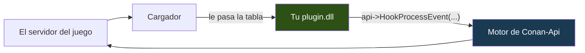

<p align="center">
  
</p>

<p align="center">
  <a href="../README.md">&nbsp;Portugu&ecirc;s</a>
  &nbsp;&nbsp;&middot;&nbsp;&nbsp;
  <a href="README.en.md">&nbsp;English</a>
  &nbsp;&nbsp;&middot;&nbsp;&nbsp;
  <a href="README.es.md">&nbsp;<b>Espa&ntilde;ol</b></a>
</p>

# Conan-Api SDK — escribe plugins para Conan Exiles

Necesitas **un header** y un compilador C++. No hay biblioteca que enlazar, no
hay código nuestro que compilar junto al tuyo, no hay proyecto que configurar.

```cpp
#include "Conan/ConanPluginApi.h"

static const ConanApiTabela* g_api = nullptr;

extern "C" ConanAcao AlHablar(ConanChamada* c)
{
    char texto[512];
    g_api->LerTextoDoJogo(c->Parms, 0x068, texto, sizeof(texto));

    if (texto[0] != '!') return CONAN_CONTINUAR;   // charla normal, la deja pasar

    g_api->Log("alguien escribió: %s", texto);
    return CONAN_CANCELAR;                          // se traga el mensaje
}

extern "C" __declspec(dllexport)
void ConanPluginCarregar(const ConanApiTabela* api)
{
    if (!api || api->tamanho < sizeof(ConanApiTabela)) return;
    g_api = api;
    g_api->HookProcessEvent("ServerSendChatMessage", AlHablar, nullptr, 100);
}
```

Compílalo como DLL x64, ponlo en una carpeta con el nombre de tu plugin dentro
de `Conan-Api/Plugins/`, reinicia el servidor. Se acabó.

---

## Por qué tu compilador no importa

La mayoría de las APIs de plugins te obliga a usar exactamente el compilador que
ellas usaron. El motivo es real: una biblioteca C++ no sobrevive a un cambio de
compilador. La disposición de `std::string` y de una vtable cambia entre MSVC y
MinGW, y cambia hasta entre versiones de MSVC. Cuando no coincide, no da un error
claro — enlaza, corre, y corrompe memoria en la primera cadena que cruce la
frontera.

Aquí eso no pasa, porque **no enlazas nada nuestro**. El cargador llama a tu
plugin pasándole una tabla de punteros a función, y tú lo llamas todo por
`api->`:



Todo en C puro: un `struct` de punteros a función, convención `__cdecl`. Visual
Studio de cualquier versión, MinGW, clang — todos están de acuerdo en esto.

**Un efecto colateral que vale la pena saber:** como el motor vive de nuestro
lado, cuando corregimos un defecto en él, no hace falta recompilar tu plugin.

---

## Visual Studio

1. **Nuevo Proyecto** → *Biblioteca de Vínculos Dinámicos (DLL)*
2. **C/C++ → General → Directorios de Inclusión Adicionales**: apunta a `include`
3. **C/C++ → Generación de Código → Biblioteca en Tiempo de Ejecución**: `/MT`, no `/MD`
4. **Plataforma: x64**

El `/MT` importa. Con `/MD`, tu DLL depende del runtime de Microsoft instalado en
la máquina — y el servidor corre bajo Wine, en un contenedor donde ese runtime
puede no existir. El síntoma es `LoadLibrary` fallando con un código genérico que
no explica nada. Con `/MT`, el runtime viaja dentro de tu DLL.

No hay nada que enlazar: sin `.lib`, sin `.a`, sin añadir ningún `.cpp` nuestro.

## mingw-w64

```bash
x86_64-w64-mingw32-g++ -std=c++17 -O2 -shared \
    -I ruta/hacia/include \
    -o MiPlugin.dll MiPlugin.cpp \
    -static-libgcc -static-libstdc++
```

Los `-static-*` por el mismo motivo que el `/MT`.

---

## Empieza copiando un ejemplo

```bash
cp -r Exemplos/ExemploOla MiPlugin
cd MiPlugin
mv ExemploOla.cpp MiPlugin.cpp
sed -i 's/ExemploOla/MiPlugin/g' compilar.sh
./compilar.sh
```

| ejemplo | lo que enseña |
|---|---|
| **ExemploOla** | el plugin más pequeño que aún prueba algo: hallar objeto, llamar función, escribir en el registro |
| **ExemploComando** | interceptar `!comando` en el chat y tragarse el mensaje |
| **ExemploVigia** | dar la bienvenida al entrar, contar quién está en línea y responder comandos del chat |
| **ExemploVip** | consultar a Permission y seguir funcionando cuando no está instalado |
| **ExemploAgendado** | ejecutar código cada cierto tiempo, en el hilo correcto |
| **ExemploBlueprint** | interceptar ejecución de Blueprint — lo que el hook por nombre no ve |
| **Permission** | el plugin completo: base de datos, configuración, y una ABI que otros consumen |

---

## La estructura de un plugin

```
Conan-Api/Plugins/MiPlugin/
   MiPlugin.dll         <- el cargador busca este nombre primero
   PluginInfo.json      <- nombre, versión, lo que exiges (opcional, pero hazlo)
   config.json          <- tu configuración
   mibase.db            <- lo que grabes nace aquí
```

El `PluginInfo.json` es la tarjeta de identidad:

```json
{
  "FullName":      "Mi Plugin",
  "Description":   "Lo que hace, en una línea",
  "Version":       "1.0.0",
  "MinApiVersion": 2,
  "Dependencies":  ["Permission"]
}
```

`MinApiVersion` hace que el cargador **rechace** tu plugin en una API demasiado
vieja, en vez de dejarlo correr y leer basura. `Dependencies` garantiza que
Permission arranque antes que tú — sin eso, le preguntarías antes de que
existiera, y concluirías que no está instalado. (Esto pasó de verdad aquí.)

**Guarda todo por la API**, nunca por ruta relativa:

```cpp
const char* base = g_api->CaminhoDados("MiPlugin", "mibase.db");
```

Una ruta relativa se resuelve desde el directorio del **servidor**, no desde tu
carpeta. Un plugin nuestro ya grabó 9 MB por arranque en el sitio equivocado así.

---

## Usar el Permission

Sin enlazar nada — por debajo es `GetProcAddress`, en un header pequeño:

```cpp
#include "Conan/ConanPermission.h"

char id[64];
if (ConanPermIdDoController(controller, id, sizeof(id)) > 0)
    if (ConanPermTem(id, "miplugin.kit.diario", /*se_ausente=*/0) == 1)
        DarKit(controller);
```

Si Permission no está instalado, las funciones devuelven el valor `se_ausente`
que le pasaste — ese nombre de parámetro es "si está ausente" en portugués — y tu
plugin sigue corriendo. **Pregunta en el momento del uso, no al cargar** —
cargar es demasiado pronto.

---

## Lo que la API no te deja hacer, y por qué

**Rechazar un hook.** `HookFuncao` rechaza cerca del 32% de las direcciones, con
el motivo en `TextoRecusa`. Eso no es un fallo: es la API negándose a instalar un
desvío que algún día ejecutaría media instrucción, corrompiendo memoria horas
después, en un sitio sin relación con la causa.

**Pasar un tamaño equivocado.** `ChamarFuncao` comprueba el tamaño de cada
argumento contra el parámetro real y rechaza cuando no coincide. Si pasas un
`float` donde el juego espera un `double`, se para y lo dice. Lo medimos: **293
funciones** de esta build corrompen la pila por ese camino, y el síntoma aparece
lejos de la causa.

**Mandar texto tuyo al juego.** Lees texto que ya es del juego cuanto quieras.
Pero montar una cadena tuya y pasarla adelante tumba el servidor: el juego
destruye el bloque de parámetros al volver y llama al asignador **suyo** sobre
memoria **tuya**. Esto fue probado, no es teoría.

---


## El juego entero, con firmas de verdad

`ConanSDK.h` trae **8.287 clases** de Conan con los miembros y las funciones que
declara la propia reflexión del juego. No es una lista de nombres: **el 85% de
las 36.757 funciones tiene firma completa** — tipo y nombre de cada parámetro,
comprobados contra el servidor en marcha.

```cpp
#include "Conan/ConanSDK.h"

void ConanPluginCarregar(const ConanApiTabela* api)
{
    ConanApi::UsarTabela(api);          // <- obligatoria, una vez

    cm->TeleportPlayer(1000.0f, 2000.0f, 300.0f);   // un punto guardado
    FVector donde = actor->K2_GetActorLocation();    // dónde está
    cm->CheatSpawnItem(TemplateId, cantidad);        // un objeto para tu tienda
}
```

**`ConanApi::UsarTabela(api)` no es opcional.** El header no tiene de dónde sacar
la tabla por su cuenta — llega en tu `ConanPluginCarregar`. Sin esa línea toda
llamada del SDK se convierte en nada, en silencio; por eso la primera avisa por
`stderr` en vez de dejarte buscar el motivo.

Un parámetro de **salida** se vuelve referencia, y la API copia el valor de
vuelta:

```cpp
FHitResult golpe{};
actor->K2_SetActorLocation(destino, false, golpe, true);
```

El texto de salida se vuelve `char*` con capacidad, **decodificado** — nunca el
puntero del juego, que muere cuando la llamada retorna:

```cpp
char izq[64], der[64];
lib->Split("conan|api", "|", izq, sizeof(izq), der, sizeof(der));
```

Una lista de salida se vuelve puntero, capacidad y cuenta, con los **elementos**
copiados:

```cpp
AActor* hallados[32]; int cuantos = 0;
lib->AlgunaBusquedaDeActores(..., hallados, 32, cuantos);
```

**No enlazas nada.** El SDK entero habla por la tabla de funciones — por eso se
comporta igual en MSVC, MinGW y clang. Si algún día tu proyecto pide una
`libconanapi.a`, algo va mal: no existe biblioteca nuestra que enlazar.

El 15% restante sale como plantilla genérica, y es deliberado: son tipos que
**cargan posesión de memoria del juego** (`TArray<FString>`, `TMap`, delegados
multicast). Pasarlos por valor duplicaría punteros, y alguien liberaría dos
veces. Preferimos una plantilla sin tipo a una firma que corrompe.

---


## ¿Publicaste un plugin?

Antes de publicar, comprueba:

- [ ] compila en **x64**, con `/MT` (MSVC) o `-static-*` (MinGW)
- [ ] la carpeta lleva el nombre del plugin, y la DLL también
- [ ] todo lo que graba pasa por `CaminhoDados("TuPlugin", ...)`
- [ ] comprueba `api->tamanho` antes de usar la tabla
- [ ] `DllMain` no hace nada (ahí Windows mantiene un bloqueo global)
- [ ] tiene `PluginInfo.json` con versión y `MinApiVersion`
- [ ] **lo ejecutaste en un servidor de verdad** — compilar no es funcionar

---

## Para ejecutar un servidor

Es otro repositorio: **[Conan-Api](../../../../Conan-Api)** — el cargador, los
plugins ya hechos y cómo instalarlos.

---

## Créditos

*Conan Exiles* es de **Funcom**. Las imágenes son material de divulgación oficial
de Steam. Este proyecto es independiente y no tiene vínculo con Funcom ni con
Inflexion Games.

<p align="center">
  <a href="../README.md">&nbsp;Portugu&ecirc;s</a>
  &nbsp;&nbsp;&middot;&nbsp;&nbsp;
  <a href="README.en.md">&nbsp;English</a>
  &nbsp;&nbsp;&middot;&nbsp;&nbsp;
  <a href="README.es.md">&nbsp;<b>Espa&ntilde;ol</b></a>
</p>
