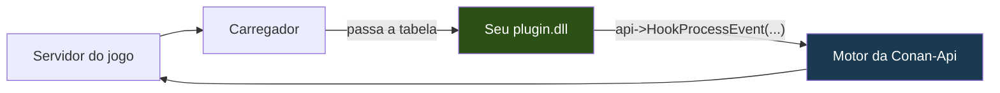

<p align="center">
  <a href="README.md">&nbsp;<b>Portugu&ecirc;s</b></a>
  &nbsp;&nbsp;&middot;&nbsp;&nbsp;
  <a href="Docs/README.en.md">&nbsp;English</a>
  &nbsp;&nbsp;&middot;&nbsp;&nbsp;
  <a href="Docs/README.es.md">&nbsp;Espa&ntilde;ol</a>
</p>

# Conan-Api SDK — escreva plugins para Conan Exiles

Você precisa de **um header** e de um compilador C++. Não tem biblioteca para
linkar, não tem código nosso para compilar junto, não tem projeto para
configurar.

```cpp
#include "Conan/ConanPluginApi.h"

static const ConanApiTabela* g_api = nullptr;

extern "C" ConanAcao AoFalar(ConanChamada* c)
{
    char texto[512];
    g_api->LerTextoDoJogo(c->Parms, 0x068, texto, sizeof(texto));

    if (texto[0] != '!') return CONAN_CONTINUAR;   // conversa normal, deixa passar

    g_api->Log("alguém digitou: %s", texto);
    return CONAN_CANCELAR;                          // engole a mensagem
}

extern "C" __declspec(dllexport)
void ConanPluginCarregar(const ConanApiTabela* api)
{
    if (!api || api->tamanho < sizeof(ConanApiTabela)) return;
    g_api = api;
    g_api->HookProcessEvent("ServerSendChatMessage", AoFalar, nullptr, 100);
}
```

Compile como DLL x64, ponha numa pasta com o nome do seu plugin dentro de
`Conan-Api/Plugins/`, reinicie o servidor. Acabou.

---

## Por que o seu compilador não importa

A maioria das APIs de plugin te obriga a usar exatamente o compilador que elas
usaram. O motivo é real: biblioteca C++ não atravessa compilador. O layout de
`std::string` e de vtable muda entre MSVC e MinGW, e muda até entre versões do
MSVC. Quando não bate, não dá erro claro — linka, roda, e corrompe memória na
primeira string que cruzar a fronteira.

Aqui isso não acontece, porque **você não linka nada nosso**. O carregador chama
o seu plugin passando uma tabela de ponteiros de função, e você chama tudo por
`api->`:



Tudo em C puro: `struct` de ponteiros de função, convenção `__cdecl`. Visual
Studio de qualquer versão, MinGW, clang — todos concordam sobre isso.

**Um efeito colateral que vale saber:** como o motor mora do nosso lado, quando
corrigimos um defeito nele, o seu plugin não precisa ser recompilado.

---

## Visual Studio

1. **Novo Projeto** → *Biblioteca de Vínculo Dinâmico (DLL)*
2. **C/C++ → Geral → Diretórios de Inclusão Adicionais**: aponte para `include`
3. **C/C++ → Geração de Código → Biblioteca de Runtime**: `/MT`, não `/MD`
4. **Plataforma: x64**

O `/MT` importa. Com `/MD`, sua DLL depende do runtime da Microsoft instalado na
máquina — e o servidor roda sob Wine, num contêiner onde esse runtime pode não
existir. O sintoma é `LoadLibrary` falhando com um código genérico que não
explica nada. Com `/MT`, o runtime vai dentro da sua DLL.

Não há nada para linkar: sem `.lib`, sem `.a`, sem adicionar `.cpp` nosso.

## mingw-w64

```bash
x86_64-w64-mingw32-g++ -std=c++17 -O2 -shared \
    -I caminho/para/include \
    -o MeuPlugin.dll MeuPlugin.cpp \
    -static-libgcc -static-libstdc++
```

Os `-static-*` pelo mesmo motivo do `/MT`.

---

## Comece copiando um exemplo

```bash
cp -r Exemplos/ExemploOla MeuPlugin
cd MeuPlugin
# renomeie o .cpp e ajuste as duas linhas do compilar.sh que citam ExemploOla
./compilar.sh
```

| exemplo | o que ele ensina |
|---|---|
| **ExemploOla** | o menor plugin que ainda prova algo: achar objeto, chamar função, escrever no log |
| **ExemploComando** | interceptar `!comando` no chat e engolir a mensagem |
| **ExemploVip** | consultar o Permission e continuar funcionando quando ele não está instalado |
| **ExemploAgendado** | rodar código de tempos em tempos, na thread certa |
| **ExemploBlueprint** | interceptar execução de Blueprint — o que o hook por nome não vê |
| **Permission** | o plugin completo: banco, configuração, e uma ABI que outros consomem |

---

## A estrutura de um plugin

```
Conan-Api/Plugins/MeuPlugin/
   MeuPlugin.dll        <- o carregador procura este nome primeiro
   PluginInfo.json      <- nome, versão, o que você exige (opcional, mas faça)
   config.json          <- a sua configuração
   meubanco.db          <- o que você gravar nasce aqui
```

O `PluginInfo.json` é o cartão de identidade:

```json
{
  "FullName":      "Meu Plugin",
  "Description":   "O que ele faz, em uma linha",
  "Version":       "1.0.0",
  "MinApiVersion": 2,
  "Dependencies":  ["Permission"]
}
```

`MinApiVersion` faz o carregador **recusar** seu plugin numa API velha demais,
em vez de deixá-lo rodar e ler lixo. `Dependencies` garante que o Permission
suba antes de você — sem isso, você perguntaria a ele antes de ele existir, e
concluiria que não está instalado. (Isso aconteceu de verdade aqui.)

**Guarde tudo pela API**, nunca por caminho relativo:

```cpp
const char* banco = g_api->CaminhoDados("MeuPlugin", "meubanco.db");
```

Caminho relativo é resolvido a partir do diretório do **servidor**, não da sua
pasta. Um plugin nosso já gravou 9 MB por boot no lugar errado assim.

---

## Usar o Permission

Sem linkar nada — é `GetProcAddress` por baixo, num header pequeno:

```cpp
#include "Conan/ConanPermission.h"

char id[64];
if (ConanPermIdDoController(controller, id, sizeof(id)) > 0)
    if (ConanPermTem(id, "meuplugin.kit.diario", /*se_ausente=*/0) == 1)
        DarKit(controller);
```

Se o Permission não estiver instalado, as funções devolvem o valor `se_ausente`
que você passou e o seu plugin continua rodando. **Pergunte no momento do uso,
não no carregamento** — carregar é cedo demais.

---

## O que a API não deixa você fazer, e por quê

**Recusar hook.** `HookFuncao` recusa cerca de 32% dos endereços, com o motivo
em `TextoRecusa`. Isso não é falha: é a API se negando a instalar um desvio que
um dia executaria meia instrução, corrompendo memória horas depois, num lugar
sem relação com a causa.

**Passar tamanho errado.** `ChamarFuncao` confere o tamanho de cada argumento
contra o parâmetro real e recusa quando não bate. Se você passar um `float` onde
o jogo espera `double`, ela para e diz. Medimos: **293 funções** desta build
corrompem a pilha por esse caminho, e o sintoma aparece longe da causa.

**Mandar texto seu para o jogo.** Você lê texto que já é do jogo à vontade. Mas
montar uma string sua e passá-la adiante derruba o servidor: o jogo destrói o
bloco de parâmetros ao retornar e chama o alocador **dele** sobre memória
**sua**. Isso foi testado, não é teoria.

---


## Publicou um plugin?

Antes de publicar, confira:

- [ ] compila em **x64**, com `/MT` (MSVC) ou `-static-*` (MinGW)
- [ ] a pasta tem o nome do plugin, e a DLL também
- [ ] tudo que ele grava passa por `CaminhoDados("SeuPlugin", ...)`
- [ ] confere `api->tamanho` antes de usar a tabela
- [ ] `DllMain` não faz nada (ali o Windows segura uma trava global)
- [ ] tem `PluginInfo.json` com versão e `MinApiVersion`
- [ ] **rodou num servidor de verdade** — compilar não é funcionar

---

## Para rodar um servidor

É outro repositório: **[Conan-Api](../../../Conan-Api)** — o carregador, os
plugins prontos e como instalar.

---

## Créditos

*Conan Exiles* é da **Funcom**. As imagens são material de divulgação oficial do
Steam. Este projeto é independente e não tem vínculo com a Funcom nem com a
Inflexion Games.

<p align="center">
  <a href="README.md">&nbsp;<b>Portugu&ecirc;s</b></a>
  &nbsp;&nbsp;&middot;&nbsp;&nbsp;
  <a href="Docs/README.en.md">&nbsp;English</a>
  &nbsp;&nbsp;&middot;&nbsp;&nbsp;
  <a href="Docs/README.es.md">&nbsp;Espa&ntilde;ol</a>
</p>
