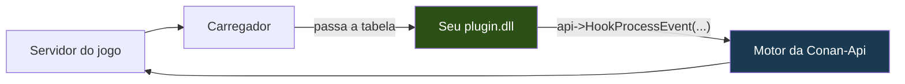

<p align="center">
  
</p>

<p align="center">
  <a href="README.md">&nbsp;<b>Portugu&ecirc;s</b></a>
  &nbsp;&nbsp;&middot;&nbsp;&nbsp;
  <a href="Docs/README.en.md">&nbsp;English</a>
  &nbsp;&nbsp;&middot;&nbsp;&nbsp;
  <a href="Docs/README.es.md">&nbsp;Espa&ntilde;ol</a>
</p>

# Conan-Api SDK — escreva plugins para Conan Exiles

Se você já escreveu plugin para **ArkApi** ou **AsaApi**, isto é a mesma coisa,
para Conan Exiles: o plugin roda dentro do servidor, o jogador não baixa nada, e
você fala com o jogo por uma tabela de funções.

Você precisa de **um header** e de um compilador C++. Não tem biblioteca para
linkar, não tem código nosso para compilar junto, não tem projeto para
configurar.

Um plugin inteiro cabe numa tela:

```cpp
#include "Conan/ConanPluginApi.h"

static const ConanApiTabela* g_api = nullptr;

// Chamado toda vez que alguém fala no chat.
extern "C" ConanAcao AoFalar(ConanChamada* c)
{
    char texto[512];
    g_api->LerTextoDoJogo(c->Parms, 0x068, texto, sizeof(texto));

    if (texto[0] != '!') return CONAN_CONTINUAR;   // conversa normal, deixa passar

    g_api->Log("alguém digitou: %s", texto);
    return CONAN_CANCELAR;                          // engole: é comando, não conversa
}

// Chamado uma vez, quando o servidor está pronto.
extern "C" __declspec(dllexport)
void ConanPluginCarregar(const ConanApiTabela* api)
{
    if (!api || api->tamanho < sizeof(ConanApiTabela)) return;
    g_api = api;
    g_api->HookProcessEvent("ServerSendChatMessage", AoFalar, nullptr, 100);
}
```

Compile como DLL x64, ponha numa pasta com o nome do seu plugin dentro de
`Conan-Api/Plugins/`, suba o servidor. Acabou.

---

## Como isso funciona, em poucas palavras

O servidor do Conan não tem sistema de plugins. Quem cria um é a **Conan-Api**,
que entra no processo do jogo junto com ele e mapeia tudo que existe lá dentro
por reflexão — as classes, os membros, as funções.

O seu plugin não conversa com o jogo. Ele conversa com a API:



Quando o carregador liga o seu plugin, ele passa uma **tabela de ponteiros de
função**. Tudo que você faz sai dali: `api->Log(...)`, `api->FindObjects(...)`,
`api->HookProcessEvent(...)`. Nada do nosso código entra no seu binário.

Isso tem três consequências práticas, e todas são boas para você:

**O seu compilador não importa.** A maioria das APIs de plugin obriga você a usar
exatamente o compilador delas. O motivo é real: biblioteca C++ não atravessa
compilador — o layout de `std::string` e de vtable muda entre MSVC e MinGW, e
muda até entre versões do MSVC. Quando não bate, não dá erro claro: linka, roda,
e corrompe memória na primeira string que cruzar a fronteira. Aqui a fronteira é
uma `struct` em C puro com convenção `__cdecl`, e sobre isso todo compilador
concorda.

**Corrigimos defeitos sem você recompilar.** O motor mora do nosso lado. Quando
consertamos algo nele, o seu plugin publicado ganha a correção sozinho.

**A tabela só cresce.** Campo novo entra sempre no **fim**, e nada é removido
nem reordenado. Isso está exercitado num servidor de verdade: um plugin
compilado contra a v3 (tabela de 328 bytes) foi carregado sobre uma API v6
(376 bytes), chamou uma função e o servidor seguiu de pé.

---

## Compilar

### Visual Studio

1. **Novo Projeto** → *Biblioteca de Vínculo Dinâmico (DLL)*
2. **C/C++ → Geral → Diretórios de Inclusão Adicionais**: aponte para `include`
3. **C/C++ → Geração de Código → Biblioteca de Runtime**: `/MT`, não `/MD`
4. **Plataforma: x64**

Ou, direto na linha de comando:

```bat
cl /nologo /std:c++17 /O2 /EHsc /LD /MT ^
   /I "caminho\do\sdk\include" ^
   MeuPlugin.cpp /Fe:MeuPlugin.dll
```

**O `/MT` importa de verdade.** Com `/MD`, a sua DLL depende do runtime da
Microsoft estar instalado na máquina — e muitos servidores rodam sob Wine, num
contêiner onde esse runtime pode não existir. O sintoma é `LoadLibrary` falhando
com um código genérico que não explica nada. Com `/MT`, o runtime vai dentro da
sua DLL e o problema não existe.

Para conferir que deu certo:

```bat
dumpbin /dependents MeuPlugin.dll
```

Deve aparecer só `KERNEL32.dll`. Se aparecer `MSVCP140.dll` ou `VCRUNTIME140.dll`,
o `/MT` não pegou.

### mingw-w64

```bash
x86_64-w64-mingw32-g++ -std=c++17 -O2 -shared \
    -I caminho/para/include \
    -o MeuPlugin.dll MeuPlugin.cpp \
    -static-libgcc -static-libstdc++
```

Os `-static-*` pelo mesmo motivo do `/MT`.

### O que testamos a cada versão

| você usa | funciona? | testado por nós |
|---|---|---|
| Visual Studio 2026 (`cl` 19.51) | sim | **sim** — a cada release |
| Visual Studio 2017–2022 (v141–v143) | sim | não diretamente; a ABI C não mudou |
| mingw-w64 (GCC 13+) | sim | **sim** — a cada build |
| clang com alvo Windows | sim | não diretamente |

Não é declaração de intenção. A cada versão nós baixamos o pacote publicado,
compilamos o `ExemploOla` com MinGW **e** com MSVC, e subimos os dois binários no
mesmo servidor. Se um dos dois parar de funcionar, a release não sai.

---

## Comece copiando um exemplo

```bash
cp -r Exemplos/ExemploOla MeuPlugin
cd MeuPlugin
mv ExemploOla.cpp MeuPlugin.cpp
sed -i 's/ExemploOla/MeuPlugin/g' compilar.sh
./compilar.sh
```

| exemplo | o que ele ensina |
|---|---|
| **ExemploOla** | o menor plugin que ainda prova algo: achar objeto, chamar função, escrever no log |
| **ExemploComando** | interceptar `!comando` no chat e engolir a mensagem |
| **ExemploVigia** | boas-vindas no login, contar quem está online, responder comandos |
| **ExemploVip** | consultar o Permission e continuar funcionando quando ele não está instalado |
| **ExemploAgendado** | rodar código de tempos em tempos, na thread certa |
| **ExemploBlueprint** | interceptar execução de Blueprint — o que o hook por nome não vê. **Leia o aviso no topo do arquivo**: uma versão anterior dele deixava uma janela em que toda execução de Blueprint era descartada em silêncio, e como o login do Conan é feito de Blueprint, ninguém entrava no servidor |
| **Permission** | o plugin completo: banco, configuração, e uma ABI que outros consomem |

---

## O jogo inteiro, com assinatura de verdade

Além da tabela, o pacote traz o **`ConanSDK.h`**: **9.247 classes** do Conan com
os membros e as funções que a própria reflexão do jogo declara. Não é uma lista
de nomes — **89% das 38.340 funções têm assinatura completa**, com tipo e nome
de cada parâmetro, conferidos contra o servidor rodando.

Na prática, você escreve assim:

```cpp
#include "Conan/ConanSDK.h"

void ConanPluginCarregar(const ConanApiTabela* api)
{
    ConanApi::UsarTabela(api);          // <- obrigatória, uma vez

    cm->TeleportPlayer(1000.0f, 2000.0f, 300.0f);   // um ponto salvo
    FVector onde = ator->K2_GetActorLocation();      // onde ele está
    cm->CheatSpawnItem(TemplateId, quantidade);      // um item para a sua loja
}
```

**`ConanApi::UsarTabela(api)` não é opcional.** O header não tem de onde tirar a
tabela sozinho — ela chega no seu `ConanPluginCarregar`. Sem essa linha, toda
chamada do SDK vira nada, em silêncio; por isso a primeira delas avisa no
`stderr` em vez de deixar você caçar o motivo.

Parâmetro de **saída** vira referência, e a API copia o valor de volta:

```cpp
FHitResult batida{};
ator->K2_SetActorLocation(destino, false, batida, true);
```

Texto de saída vira `char*` e capacidade, já **decodificado** — nunca o ponteiro
do jogo, que morre quando a chamada retorna:

```cpp
char esquerda[64], direita[64];
lib->Split("conan|api", "|", esquerda, sizeof(esquerda), direita, sizeof(direita));
```

**E você não linka nada.** O SDK inteiro conversa pela tabela — é por isso que
ele se comporta igual em MSVC, MinGW e clang. Se algum dia o seu projeto pedir
uma `libconanapi.a`, algo está errado: não existe biblioteca nossa para linkar.

Os 11% restantes saem como template genérico, e é deliberado: são tipos que
**carregam posse de memória do jogo** (`TArray<FString>`, `TMap`, delegates
multicast). Passá-los por valor duplicaria ponteiros, e alguém liberaria duas
vezes. Preferimos um template sem tipo a uma assinatura que corrompe.

---

## Do chat até o jogador: o caminho que todo plugin precisa

Este é o pulo que falta em quase toda API, e sem ele as 9.247 classes não
servem para nada: **alguém digitou algo — quem foi, e onde ele está?**

```cpp
extern "C" ConanAcao AoFalar(ConanChamada* c)
{
    // 1. QUEM: num hook, c->Obj é o objeto que recebeu a chamada.
    //    No chat, é o ConanPlayerController de quem digitou.
    void* controller = c->Obj;

    // 2. O NOME mora no PlayerState, não no controller.
    char nome[128] = "";
    if (void* ps = MembroPonteiro(controller, "PlayerState"))
    {
        const int32_t off = g_api->OffsetDoMembro(ps, "PlayerNamePrivate");
        if (off >= 0) g_api->LerTextoDoJogo(ps, uint32_t(off), nome, sizeof(nome));
    }

    // 3. O PERSONAGEM. "Character" é o pawn já tipado; "Pawn" cobre o resto.
    void* corpo = MembroPonteiro(controller, "Character");
    if (!corpo) corpo = MembroPonteiro(controller, "Pawn");

    // 4. A POSIÇÃO, pela função do jogo — não pelo campo, que é replicado.
    struct { double X, Y, Z; } pos{};
    g_api->ChamarFuncao(corpo, "K2_GetActorLocation", nullptr, nullptr, 0,
                        &pos, sizeof(pos));

    g_api->MensagemParaJogador(nome, "achei você");
    return CONAN_CANCELAR;
}
```

O `MembroPonteiro` é o auxiliar que se repete em todo plugin — resolve o offset
**pelo nome**, lê o ponteiro e recusa o que não for legível:

```cpp
static void* MembroPonteiro(void* obj, const char* nome)
{
    if (!obj) return nullptr;
    const int32_t off = g_api->OffsetDoMembro(obj, nome);   // pela reflexão
    if (off < 0) return nullptr;                            // não existe aqui

    void* p = nullptr;
    if (g_api->LerMembro(obj, uint32_t(off), &p, sizeof(p)) <= 0) return nullptr;
    if (!p || !g_api->Legivel(p, 8)) return nullptr;
    return p;
}
```

**Nenhum offset gravado.** Rodando neste servidor, `OffsetDoMembro` devolveu
`PlayerState → 0x308`, `Character → 0x350`, `Pawn → 0x340`. Escrever esses
números no seu código funciona hoje e lê o campo vizinho depois do próximo patch
— sem erro, sem log, só com dado errado.

### E sem hook nenhum?

Quando o começo não é o jogador falando — uma tarefa agendada, um comando de
admin — o caminho de entrada é varrer:

```cpp
void* pcs[64];
int n = g_api->FindObjects("ConanPlayerController", pcs, 64, /*incluirFilhas=*/1);
```

Daí em diante é o mesmo: `PlayerState` para o nome, `Character` para o corpo.

**Não guarde esses ponteiros entre chamadas.** O coletor de lixo do jogo destrói
objetos e reaproveita endereços; `Legivel` continuaria dizendo que sim, porque a
página segue mapeada, e você agiria sobre outra coisa. Pegue de novo a cada uso.

O exemplo completo, com log e tratamento de cada caso, está em
`Exemplos/ExemploJogador`.

---

## A estrutura de um plugin

```
Conan-Api/Plugins/MeuPlugin/
   MeuPlugin.dll        <- o carregador procura este nome primeiro
   PluginInfo.json      <- nome, versão, o que você exige (opcional, mas faça)
   config.json          <- a sua configuração
   meubanco.db          <- o que você gravar nasce aqui
```

### O que é obrigatório, e o que não é

**Só a DLL.** Um plugin com nada além dela carrega e funciona — o `Cartografo` e
o `GravadorDeEventos` deste projeto rodam assim, e o log mostra:

```
  [ok] Cartografo   [sem PluginInfo.json]
```

Os outros dois arquivos são escolhas suas:

| arquivo | obrigatório? | quem lê |
|---|---|---|
| `MeuPlugin.dll` | **sim** — é a única coisa que o carregador precisa | o carregador |
| `PluginInfo.json` | não | o carregador, **se** existir |
| `config.json` | não | **o seu plugin**; a API nem abre o arquivo |

O `config.json` não tem formato imposto por ninguém. A API só te diz **onde** ele
fica, com `CaminhoConfig("MeuPlugin")`, e o resto é com você — pode ser JSON,
pode ser outro nome, pode não existir.

**Sem `PluginInfo.json` você perde quatro coisas**, e vale saber quais antes de
decidir pular:

- o nome e a versão do seu plugin no log (aparece só o nome da pasta)
- `MinApiVersion` — o carregador não tem como recusar seu plugin numa API velha
- `Dependencies` — ninguém garante que o Permission suba antes de você
- `BuildDoJogo` / `UsaOffsetsCrus` — sem eles, seu plugin carrega depois de uma
  atualização do jogo mesmo quando não deveria

Para um plugin que você só usa, nada disso importa. Para um que você **publica**,
todos importam.

O `PluginInfo.json` é o cartão de identidade do seu plugin:

```json
{
  "FullName":      "Meu Plugin",
  "Description":   "O que ele faz, em uma linha",
  "Version":       "1.0.0",
  "MinApiVersion": 3,
  "Dependencies":  ["Permission"]
}
```

**`MinApiVersion`** faz o carregador **recusar** o seu plugin numa API velha
demais, em vez de deixá-lo rodar e ler lixo. A tabela desta versão é a **v6** —
mas declare o menor número de que você realmente precisa, não o mais alto. Quem
pede v6 sem usar nada da v6 se recusa a rodar num servidor que ainda está na v5,
sem motivo nenhum.

**`Dependencies`** garante que o Permission suba antes de você. Sem isso, você
perguntaria a ele antes de ele existir e concluiria que não está instalado.
(Aconteceu de verdade aqui, com um plugin nosso.)

**Guarde tudo pela API**, nunca por caminho relativo:

```cpp
const char* banco = g_api->CaminhoDados("MeuPlugin", "meubanco.db");
```

Caminho relativo é resolvido a partir do diretório do **servidor**, não da sua
pasta. Um plugin nosso já gravou 9 MB por boot no lugar errado assim.

---

## Se o seu plugin usa offset cru, declare

Esta é a diferença entre um plugin que sobrevive a uma atualização do Conan e um
que passa a ler memória errada em silêncio:

```json
{ "BuildDoJogo": 24784646, "UsaOffsetsCrus": true }
```

Quando você declara e a build do jogo muda, **o carregador recusa o seu plugin**
e diz ao dono do servidor para pedir a versão nova a você. Sem a declaração, ele
carrega e lê o campo vizinho — sem erro, sem log, sem pista.

**Como não precisar disso:** use `api->OffsetDoMembro(obj, "NomeDoCampo")` em vez
do número. Ele resolve pela reflexão, na build que estiver rodando, e o seu
plugin atravessa a atualização sem você fazer nada.

---

## Responder no primeiro segundo

O servidor aceita jogador **antes** de o mundo terminar de montar. Nessa janela a
reflexão ainda não existe, então um plugin ligado só depois dela deixa sem
resposta quem digitou um comando cedo.

Para isso existe um segundo ponto de entrada, opcional:

```cpp
extern "C" __declspec(dllexport)
void ConanPluginRegistrar(const ConanApiTabela* api)   // ANTES do mundo
{
    ConanApi::UsarTabela(api);
    g_id = api->HookProcessEvent("ServerSendChatMessage", AoFalar, nullptr, 100);
}
```

`HookProcessEvent` chamado aqui **entra numa fila** e devolve um id válido na
hora. A API arma o hook no instante em que o mundo monta — antes de qualquer
plugin ser ligado.

**O que você não pode fazer aqui:** tocar em objeto do jogo. Não há mundo, e
`FindClass`/`FindObjects` devolvem nada. Se você precisa do mundo, o lugar é o
`ConanPluginCarregar`.

Você não precisa exportar o `Registrar`. Sem ele tudo funciona como antes — ele
só encurta a janela.

---

## Usar o Permission

Sem linkar nada — é `GetProcAddress` por baixo, num header pequeno:

```cpp
#include "Conan/ConanPermission.h"

char id[64];
if (ConanPermIdDoController(controller, id, sizeof(id)) > 0)
    if (ConanPermTem(id, "meuplugin.kit.diario", /*se_ausente=*/0) == 1)
        DarKit(controller);
```

Se o Permission não estiver instalado, as funções devolvem o valor `se_ausente`
que você passou e o seu plugin continua rodando.

**Pergunte no momento do uso, não no carregamento.** E escolha o `se_ausente`
pelo custo do erro: para um kit de VIP, `0` (negar por trinta segundos incomoda;
dar de graça a todo mundo durante uma queda de banco, não desfaz).

---

## O que a API não deixa você fazer, e por quê

**Hookar qualquer endereço.** `HookFuncao` recusa cerca de 32% deles, com o
motivo em `TextoRecusa`. Isso não é falha: é a API se negando a instalar um
desvio que um dia executaria meia instrução, corrompendo memória horas depois,
num lugar sem relação com a causa.

**Passar tamanho errado.** `ChamarFuncao` confere o tamanho de cada argumento
contra o parâmetro real e recusa quando não bate. Se você passar um `float` onde
o jogo espera `double`, ela para e diz. Medimos: **293 funções** desta build
corrompem a pilha por esse caminho, e o sintoma aparece longe da causa.

**Montar você mesmo uma string do jogo.** O jogo destrói o bloco de parâmetros ao
retornar e chama o alocador **dele** sobre o ponteiro que estiver lá. Se for
memória sua, o servidor cai — testado, não é teoria.

Você não precisa fazer isso: **escreva texto normal e a API monta**.

```cpp
g_api->MensagemParaTodos("O servidor reinicia em 5 minutos.");
g_api->MensagemParaJogador("NomeDoJogador", "Kit entregue. Volte em 24h.");
g_api->MensagemNaTela(playerController, "Bem-vindo!", 8.0f);
```

Por baixo, a API pede a `FString` (ou o `FText`) ao **próprio jogo** e devolve o
que ele construiu. Nenhuma memória sua atravessa a fronteira, e quem aloca é
quem libera.

---

## Quando não funciona: onde olhar

Dois arquivos respondem quase tudo, em `Conan-Api/Logs/`:

| arquivo | o que ele conta |
|---|---|
| `ConanLoader.log` | quais plugins o carregador **viu**, quais **recusou** e por quê |
| `ConanApi.log` | o que os plugins escreveram com `Log()`, e os avisos do motor |

**A DLL não abre.** Quase sempre é arquitetura (compilou x86 em vez de x64) ou
`/MD` em vez de `/MT`. O erro `193` do Windows significa, na prática, 32 bits.

**Abriu, mas nada acontece.** Confira se o nome da pasta e o da DLL batem, e se
você exportou `ConanPluginCarregar`. No MSVC, sem `extern "C"` o nome sai
decorado e o carregador não acha:

```bat
dumpbin /exports MeuPlugin.dll | findstr ConanPlugin
```

Deve aparecer `ConanPluginCarregar`, não `?ConanPluginCarregar@@YAXPEBU...`.

**As chamadas do `ConanSDK.h` não fazem nada.** Faltou `ConanApi::UsarTabela(api)`.

**A função responde `false` e você não sabe se rodou.** Use
`api->UltimaChamadaExecutou()`. O jogo filtra chamadas em objeto-modelo e ator
não inicializado, e nesses casos o retorno vem de um bloco zerado — sem esse
sinal, "a função disse não" e "a função não rodou" viram o mesmo `false`.

**Escreveu num campo e o cliente não vê.** O campo é replicado; são 1.222 dos
36.210 desta build. Pergunte antes com `api->EhReplicado(...)` e prefira chamar a
função do jogo, que percorre o caminho que já replica.

---


## Publicou um plugin?

Abra uma *issue* aqui contando. A ideia é ter uma lista no README para quem
administra servidor encontrar o que existe.

Antes de publicar, uma lista curta:

- [ ] compila em x64, com `/MT` (MSVC) ou `-static-*` (MinGW)
- [ ] a pasta tem o nome do plugin, e a DLL também
- [ ] tudo que ele grava passa por `CaminhoDados("SeuPlugin", ...)`
- [ ] confere `api->tamanho` antes de usar a tabela
- [ ] o `DllMain` não faz nada
- [ ] se usa o Permission, consulta no uso e degrada quando ele falta
- [ ] rodou num servidor de verdade — teste não prova o caminho real

---

## Para rodar um servidor

É outro repositório: **[Conan-Api](../../../Conan-Api)**. Lá estão o carregador,
o pacote pronto e o guia de instalação.

São separados de propósito: quem administra um servidor não precisa de
compilador para nada, e quem escreve plugin não precisa dos binários do servidor.

---

## Licença, em três linhas

**O que você escreve é seu, e você pode vender.** Plugin feito com esta API tem
a licença que você quiser, sem pedir autorização, sem pagar nada, sem dividir
nada. Servidor que cobra dos jogadores também pode usar.

**A API em si não se revende.** Ela não pode ser vendida, licenciada, alugada,
nem incluída em pacote comercial. E não se re-hospeda: nada de espelhar o
download ou embutir os arquivos em outro instalador.

**O link é livre.** Divulgue e indexe o link deste repositório onde quiser —
site, fórum, vídeo, marketplace. Quem quiser a API pega aqui.

O texto completo está no [LICENSE](LICENSE), e ele explica o porquê: a API é a
fundação, e existe **uma** para que haja um caminho de atualização quando o jogo
muda, em vez de cinco cópias divergentes que ninguém acompanha.

---

## Créditos

*Conan Exiles* é da **Funcom**. As imagens deste repositório são material de
divulgação oficial, do Steam. Este projeto não tem vínculo com a Funcom nem com
a Inflexion Games.

Esta API é trabalho independente, feito por engenharia reversa do servidor
dedicado, sem SDK oficial e sem símbolos de depuração.

<p align="center">
  <a href="README.md">&nbsp;<b>Portugu&ecirc;s</b></a>
  &nbsp;&nbsp;&middot;&nbsp;&nbsp;
  <a href="Docs/README.en.md">&nbsp;English</a>
  &nbsp;&nbsp;&middot;&nbsp;&nbsp;
  <a href="Docs/README.es.md">&nbsp;Espa&ntilde;ol</a>
</p>
